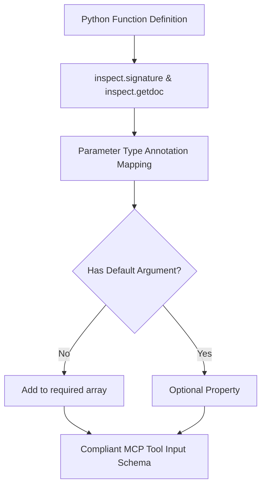

# genpark-dynamic-json-schema-tool-synthesizer-skill

Agent Skill implementing **Reflection-Driven JSON Schema Tool Synthesis** in 100% Python standard library.

## Architectural Flow

```mermaid
flowchart TD
    Func["Python Function Definition"] --> Inspect["inspect.signature & inspect.getdoc"]
    Inspect --> ParamLoop["Parameter Type Annotation Mapping"]
    ParamLoop --> RequiredCheck{"Has Default Argument?"}
    RequiredCheck -->|No| Req["Add to required array"]
    RequiredCheck -->|Yes| Opt["Optional Property"]
    Req & Opt --> Schema["Compliant MCP Tool Input Schema"]
```
